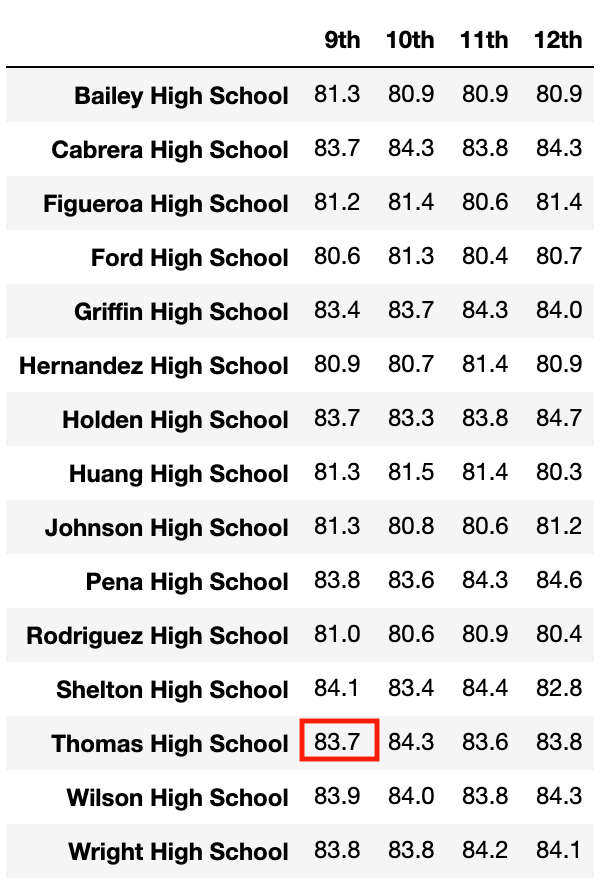

# An Analysis on Student Performance in a School District with 15 High Schools

## Overview of the analysis
### Purpose
The purposes of this analysis are listed below:
- To analyse the relationship between student performance (math and reading scores) and grade, school spending, school size and school type respectively.
- To explore how ommiting the scores for Thomas High School ninth graders can affect the result of school district analysis.

## Results
- How is the district summary affected?

- How is the school summary affected?

- How does replacing the ninth graders’ math and reading scores affect Thomas High School’s performance relative to the other schools?

- How does replacing the ninth-grade scores affect the following:

    - Math and reading scores by grade
    
     
    
    
    
    
    - Scores by school spending
    
    
    
    
    - Scores by school size
    
    
    
    
    - Scores by school type
    
    
    
    
   
## Summary
